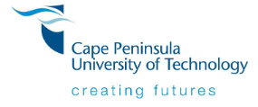

<!-- ========================================================= -->

  
    
  <strong>“Building Professional Readiness through Reflection, Evidence, and Growth.”</strong>

---

## 📚 INTRODUCTION  

Welcome to my **PRP372S Work Readiness Portfolio of Evidence**.  
This digital portfolio documents my professional development journey through the **Work Readiness Program** at CPUT.  

Using the *Collect, Select, Reflect, and Connect* framework, I have included artefacts and STAR reflections that demonstrate my growth in key employability areas.  

The portfolio reflects both my **academic performance** and **personal development** as I prepare to transition into the professional IT environment.

---

## 🧩 E-PORTFOLIO FRAMEWORK  

| Step | Description |
|------|--------------|
| **Collect** | Gathered evidence and artefacts from the Work Readiness modules (screenshots). |
| **Select** | Chose the most relevant artefacts that best demonstrate learning outcomes and growth. |
| **Reflect** | Used the STAR (Situation, Task, Action, Result) model to provide structured, meaningful reflection. |
| **Connect** | Linked each learning experience to professional and personal goals for career advancement. |

---

# 🌟 DIGITAL PORTFOLIO CONTENTS  

## 💬 1. BUSINESS COMMUNICATION  

### 🔗 Evidence (10%)  

### 🧠 Reflection – STAR Technique (10%)  
**Situation:**  
As part of the Work Readiness module, I completed the *Business Communication* course to improve my ability to communicate in a professional context.  

**Task:**  
I aimed to develop the skills to use the correct tone, format, and structure for formal business correspondence.  

**Action:**  
I practiced writing business emails, applying grammar rules, and understanding when to use formal vs informal communication. I also participated in class discussions on communication barriers and digital etiquette.  

**Result:**  
I can now confidently compose professional messages, deliver effective presentations, and maintain clear communication in both written and virtual environments.

---

## 🎙 2. INTERVIEW SKILLS  

### 🔗 Evidence (10%)  

### 🧠 Reflection – STAR Technique (10%)  
**Situation:**  
Before internship applications, I needed to improve how I present myself professionally during interviews.  

**Task:**  
I wanted to learn how to structure responses and express confidence while aligning my skills with job requirements.  

**Action:**  
I completed the *Interview Skills* module, practiced answering common questions using the STAR method, and worked on non-verbal communication such as posture and eye contact.  

**Result:**  
I now enter interviews with confidence, communicate clearly, and respond to questions using examples that highlight my IT and teamwork experience.

---

## 🎥 3. MOCK INTERVIEW  

### 🔗 Evidence (10%)  

### 🧠 Reflection – STAR Technique (10%)  
**Situation:**  
I participated in a *Mock Interview* session as a simulation of a real job interview.  

**Task:**  
My task was to apply the interview skills learned and receive professional feedback.  

**Action:**  
I prepared a professional outfit, practiced my introduction, and answered each question using the STAR structure. I also reviewed my performance afterward based on peer and lecturer feedback.  

**Result:**  
The experience improved my professionalism and ability to stay calm under pressure. I now understand the importance of preparation, confidence, and concise answers during interviews.

---

## 🤝 4. PROFESSIONAL NETWORKING  

### 🔗 Evidence (10%)  

### 🧠 Reflection – STAR Technique (10%)  
**Situation:**  
The *Professional Networking* module helped me understand how to create and maintain career-related relationships.  

**Task:**  
My goal was to establish a professional online presence and engage meaningfully with others in my field.  

**Action:**  
I created a LinkedIn profile, connected with industry professionals, and attended virtual career readiness events hosted by CPUT. I also engaged with content relevant to my career goals.  

**Result:**  
I built a growing network of IT professionals, peers, and mentors. This has enhanced my confidence in professional interactions and expanded my career opportunities.

---

## 🧭 5. WORKPLACE ETIQUETTE  

### 🔗 Evidence (10%)  

### 🧠 Reflection – STAR Technique (10%)  
**Situation:**  
As part of my professional preparation, I explored lessons on *Workplace Etiquette* to understand proper behavior in a formal work environment.  

**Task:**  
I aimed to learn how to demonstrate respect, teamwork, punctuality, and ethics in professional spaces.  

**Action:**  
I completed quizzes and readings on corporate behavior, dress code, meeting etiquette, and email professionalism. I practiced these skills during class projects and presentations.  

**Result:**  
I now understand how to conduct myself professionally in any setting, communicate respectfully with colleagues, and uphold integrity and discipline as an employee.

---

# 🧾 CONCLUSION – CONNECT PHASE  

This portfolio captures the full journey of my **Work Readiness development**. Through structured reflection and evidence collection, I demonstrated measurable growth in communication, professionalism, networking, and interview skills.  

These competencies have prepared me to:
- Communicate effectively with confidence.  
- Perform well in professional interviews.  
- Engage meaningfully in workplace and networking environments.  
- Demonstrate professional conduct and ethical standards.  

---

> “Professional growth is not a destination — it’s a journey of learning, reflection, and action.”  
> — *Swatsi Ratia (2025), Personal Reflection, PRP372S Digital Portfolio*

